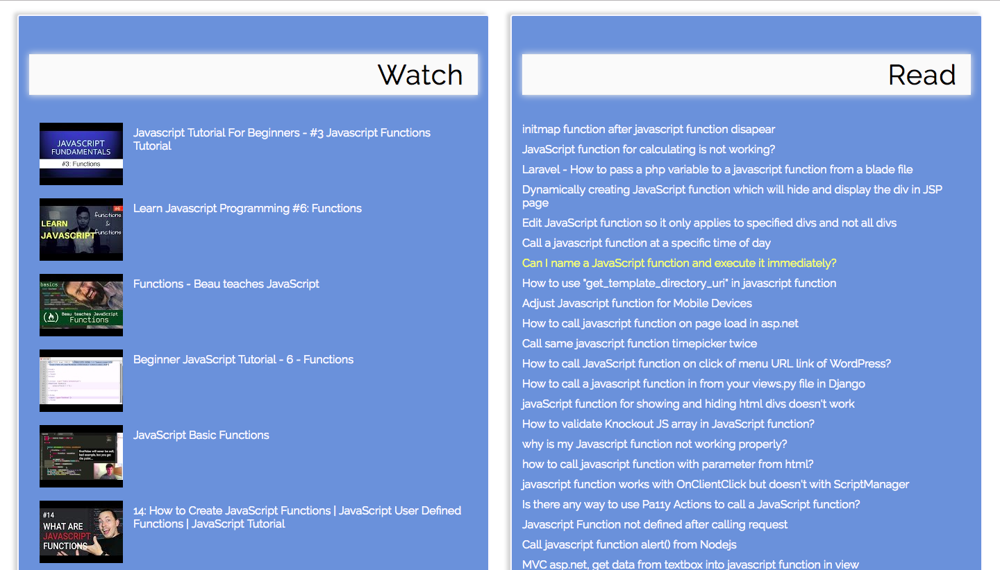

# Javascript Library 

Javascript Library is an app that helps users generate Stackoverflow answers and YouTube videos based on what Javascript term they want to research.

# Live Demo
https://tanyagriego.github.io/javascript-library/

# Technologies
• Javascript
• JQuery
• HTML
• CSS

# Screenshots
Search Page:

Results Page:

